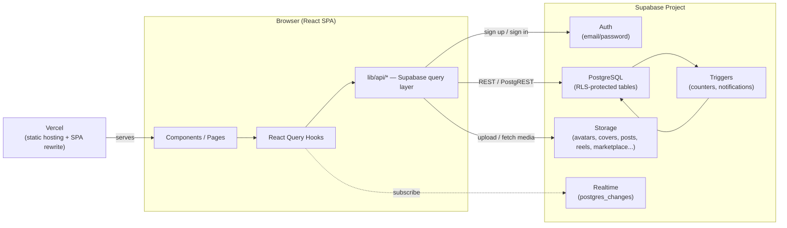

# TorqueGrid

A full-stack automotive social platform where car and bike enthusiasts showcase their vehicles, share builds, join communities, trade parts, and book services — in one place.

## Overview

Enthusiast communities are currently scattered across general-purpose social apps, classifieds sites, and forums, none of which understand what an automotive profile actually looks like — a garage of vehicles, a modification history, a maintenance log. TorqueGrid exists to give that a proper home.

At a high level, it is a React single-page application backed entirely by Supabase: Postgres for data, Supabase Auth for identity, Supabase Storage for media, and Supabase Realtime for live updates. There is no separate custom backend server — the frontend talks to Supabase directly through a typed API layer, with authorization enforced at the database level via Row Level Security (RLS) rather than in application code.

**Target users:** car and motorcycle owners who want to document their build, follow other owners, join marque/region-based crews, attend meetups, buy and sell vehicles or parts, and get service quotes from verified providers.

## Key Features

- **Garage & Vehicle Profiles** — Add vehicles with make/model/year, track modifications and a timeline of maintenance/build entries.
- **Social Feed** — Post updates, reels, and photos; like, comment, save, and follow other members, all persisted to the database with optimistic UI updates.
- **Reels** — A vertical, 9:16 (Instagram Reels / YouTube Shorts–style) video/photo feed with wheel and keyboard navigation.
- **Communities** — Public and private crews with member rosters and real-time group chat.
- **Events & Meetups** — Browse and RSVP to meetups, track days, shows, and drives.
- **Marketplace** — List and browse vehicles and parts for sale, with a built-in buyer enquiry flow.
- **Services** — Directory of verified service providers with a "Get a Quote" contact form, validated and stored server-side.
- **Knowledge Base** — A searchable vehicle catalog, a parts encyclopedia, maintenance guides, and news articles.
- **Notifications** — Real-time, per-user notification feed for follows, likes, and comments, powered by database triggers.
- **Light / Dark Theme** — App-wide theme toggle, persisted across sessions via `localStorage` and CSS custom properties.
- **Responsive Layout** — Adaptive navigation: a top nav bar on desktop, a bottom tab bar on mobile.

## Tech Stack

**Frontend**
- [React 19](https://react.dev/) with [React Router 7](https://reactrouter.com/)
- [Vite 8](https://vitejs.dev/) (Rolldown-based build)
- [TanStack React Query v5](https://tanstack.com/query/latest) for server-state caching, mutations, and optimistic updates
- [Tailwind CSS 4](https://tailwindcss.com/) + CSS custom properties for theming
- [Framer Motion](https://www.framer.com/motion/) for animation
- [Lucide React](https://lucide.dev/) for icons
- [react-hot-toast](https://react-hot-toast.com/) for toast notifications

**Backend / Database**
- [Supabase](https://supabase.com/) (PostgreSQL, Auth, Storage, Realtime) — no separate custom API server
- Authorization enforced via PostgreSQL **Row Level Security (RLS)** policies, not application code
- Database triggers for denormalized counters (follower counts, like counts, etc.) and notification creation

**Authentication**
- Supabase Auth (email/password), with a `handle_new_user` trigger that auto-provisions a `profiles` row on signup

**Infrastructure / Deployment**
- [Vercel](https://vercel.com/) (static SPA build, with a rewrite rule so client-side routing works on refresh)

**Development Tools**
- ESLint 10 (flat config) with React Hooks and React Refresh plugins

> Note: `three`, `@react-three/fiber`, and `@react-three/drei` remain in `package.json` from an earlier 3D hero experiment that was reverted in favor of the current 2D hero. The related component is not imported anywhere in the app and is safe to remove along with these dependencies in a future cleanup.

## Architecture

The app has no backend server of its own. The React SPA calls the Supabase-generated REST API directly using `@supabase/supabase-js`. Every table has RLS enabled, so the same anonymous/publishable key is safe to ship in the client bundle — Postgres itself decides what each request is allowed to read or write.



## Project Structure

```
automotive-platform/
├── public/                  # Static assets (favicon, icon sprite, security headers)
├── src/
│   ├── components/
│   │   ├── auth/             # Sign in / sign up / password reset flow
│   │   ├── community/        # Crews, meetups, motorsport, group chat
│   │   ├── explore/           # Feed, garage, reels, news
│   │   ├── knowledge/          # Vehicle catalog, parts encyclopedia, guides
│   │   ├── layout/             # App shell, top nav, mobile bottom nav
│   │   ├── marketplace/        # Vehicle & part listings
│   │   ├── services/           # Service provider directory + quote form
│   │   └── ui/                  # Shared design-system primitives (Button, Modal, Card, etc.)
│   ├── context/                  # React context (AuthContext)
│   ├── hooks/                    # React Query hooks (one per domain, e.g. usePosts, useEvents)
│   ├── lib/
│   │   ├── api/                    # Supabase query functions, one module per domain
│   │   ├── supabase.js             # Supabase client + isSupabaseConfigured guard
│   │   ├── theme.js                 # Design tokens (CSS variable references)
│   │   └── auth.js / apiUtils.js
│   ├── App.jsx                       # Route definitions
│   └── main.jsx                       # App entry point, QueryClient setup
├── supabase/
│   └── schema.sql                      # Complete, idempotent database schema (tables, RLS, triggers, storage, seed data)
├── .env.example                          # Required environment variables (see below)
├── vercel.json                            # Vercel build & SPA rewrite configuration
└── vite.config.js                          # Vite build config (manual chunk splitting)
```

## How It Works

1. **Request** — A component calls a React Query hook (e.g. `usePosts()`), which calls a function in `src/lib/api/*`.
2. **Query** — That function issues a request through `@supabase/supabase-js` directly to the Supabase project — no intermediate API server.
3. **Authorization** — PostgreSQL evaluates the relevant Row Level Security policy against the caller's JWT (or lack of one) before returning or writing any row.
4. **Side effects** — For write operations (e.g. liking a post, following a user), a database trigger updates denormalized counters and, where relevant, inserts a notification row.
5. **Response** — React Query caches the result, and mutations use optimistic updates so the UI reflects a change immediately, rolling back if the write fails.
6. **Live updates** — Screens like community chat and notifications subscribe to Supabase Realtime so changes from other users appear without a manual refresh.

## Prerequisites

- [Node.js](https://nodejs.org/) 18 or later
- npm (bundled with Node.js)
- A [Supabase](https://supabase.com/) project (free tier is sufficient)

## Installation

```bash
# Clone the repository
git clone <YOUR_REPOSITORY_URL>
cd automotive-platform

# Install dependencies
npm install
```

## Environment Variables

Copy `.env.example` to `.env.local` and fill in your Supabase project's values (**Supabase Dashboard → Settings → API**):

```env
VITE_SUPABASE_URL=<your_supabase_project_url>
VITE_SUPABASE_ANON_KEY=<your_supabase_anon_public_key>
```

> Vite only reads environment files at server startup — restart `npm run dev` after changing them.

## Running the Project

**Set up the database** (one time, or after a schema change): open the Supabase SQL Editor and run the contents of [`supabase/schema.sql`](supabase/schema.sql). It is idempotent and safe to re-run.

```bash
npm run dev
```

Starts the Vite dev server (default: `http://localhost:5173`) with hot module reloading.

```bash
npm run build
```

Produces a production build in `dist/`.

```bash
npm run preview
```

Serves the production build locally for a final check before deploying.

```bash
npm run lint
```

Runs ESLint across the project.

## Usage

Once running, open the app and:

1. Sign up with an email and password (Supabase Auth issues a session immediately if email confirmation is disabled on your project, or after confirming via the emailed link otherwise).
2. Add your first vehicle during onboarding, or later from **My Garage**.
3. Browse **Explore** to post updates, watch Reels, and follow other members.
4. Join a **Community**, RSVP to an **Event**, or list something in the **Marketplace**.

## Database

**Technology:** PostgreSQL, managed by Supabase.

The full schema — 30 tables across identity, garage, social, community, events, marketplace, services, knowledge, motorsport, and notifications — lives in a single idempotent file: [`supabase/schema.sql`](supabase/schema.sql). It includes:

- Table definitions with indexes for common query patterns
- Row Level Security policies on every table
- Triggers that maintain denormalized counters (follower/following counts, like/comment counts, member counts) and create notifications
- Storage bucket setup (`avatars`, `covers`, `posts`, `reels`, `wallpapers`, `marketplace`, `community-media`) with matching storage policies
- Realtime publication registration for tables that need live updates
- Reference seed data (vehicle catalog entries, parts glossary, badge definitions) — no fake users or posts

**Key entities and relationships:**

| Table | Purpose |
|---|---|
| `profiles` | One row per user, mirrors `auth.users.id` |
| `vehicles` | A user's garage; `vehicle_modifications` and `vehicle_timeline` reference it |
| `posts` | Feed content (posts, reels, wallpapers); `post_likes`, `saved_posts`, `comments` reference it |
| `follows` | Directed follow edges between profiles |
| `communities` | Crews/groups; `community_members` and `community_messages` reference it |
| `events` | Meetups/track days; `event_attendees` reference it |
| `marketplace_vehicles` / `marketplace_parts` | Listings; `marketplace_enquiries` reference either by `(listing_id, listing_type)` |
| `services` | Provider directory; `service_reviews` and `service_enquiries` reference it |
| `notifications` | Per-user notification inbox, populated by triggers |

To apply the schema to a fresh or reset project:

```sql
-- In the Supabase SQL Editor, if starting clean:
DROP SCHEMA public CASCADE;
CREATE SCHEMA public;
-- Then paste and run the full contents of supabase/schema.sql
```

## Authentication & Security

- Authentication is handled entirely by **Supabase Auth** (email/password). No custom session or token logic exists in the app.
- On signup, a database trigger (`handle_new_user`) automatically creates the corresponding `profiles` row, de-duplicating the username if needed.
- **Authorization is enforced at the database layer** via Row Level Security — every table has RLS enabled, and policies scope reads/writes to what a given user (or anonymous visitor, for public content) is allowed to touch. The frontend does not need to duplicate these rules; an unauthorized request is rejected by Postgres itself.
- The Supabase anon/publishable key is safe to expose in the client bundle by design — it identifies the project, not a privileged user, and RLS is what actually restricts access.
- Never commit real values for `VITE_SUPABASE_URL` / `VITE_SUPABASE_ANON_KEY` (or any `.env*` file) to version control — `.env.local` is already git-ignored.

## Deployment

The project is configured for deployment on **Vercel**:

- `vercel.json` sets the build command (`npm run build`), output directory (`dist`), and a catch-all rewrite so client-side routes (e.g. `/app/explore`) resolve correctly on a hard refresh.
- Add `VITE_SUPABASE_URL` and `VITE_SUPABASE_ANON_KEY` as environment variables in the Vercel project settings (**Project → Settings → Environment Variables**) before deploying — Vite bakes them into the build at build time.
- `public/_headers` sets baseline security headers (`X-Frame-Options`, `X-Content-Type-Options`, `Referrer-Policy`, `Permissions-Policy`).

```bash
# Via the Vercel CLI
npm install -g vercel
vercel
```

Or connect the repository directly through the Vercel dashboard for automatic deploys on push.

## Testing

There is currently no automated test suite in this project. Verification has so far been performed through manual QA: exercising each route, form, and database mutation directly in a running instance of the app (auth flows, follow/save persistence, marketplace and service forms, responsive layouts, and console error checks).

Adding an automated suite (e.g. [Vitest](https://vitest.dev/) + [React Testing Library](https://testing-library.com/react/)) is recommended before scaling the codebase further — see [Roadmap](#roadmap).

## Troubleshooting

**"supabaseUrl is required" / blank white screen on load**
`VITE_SUPABASE_URL` or `VITE_SUPABASE_ANON_KEY` is missing or empty in `.env.local`. Confirm both are set and restart `npm run dev`.

**Signup/login fails with "Failed to fetch"**
This is a network-level failure, not a validation error — the app cannot reach the Supabase host at all. Confirm `VITE_SUPABASE_URL` is correct and the project is active (not deleted or paused) in the Supabase dashboard.

**`ERROR: 42710: policy "..." already exists` when running the schema**
PostgreSQL has no `CREATE POLICY IF NOT EXISTS`. `supabase/schema.sql` already guards against this with `DROP POLICY IF EXISTS` before every `CREATE POLICY`; if you're running an older or partial script, use the current file instead. On a database with a partially-applied schema, drop and recreate the `public` schema (see [Database](#database)) rather than re-running an old script on top of it.

**Environment variable changes have no effect**
Vite reads `.env*` files only at server startup. Restart `npm run dev` after any change.

**Marketplace / Knowledge / News pages appear to load nothing**
Usually means the running dev server started before `.env.local` was corrected. Restart the dev server so it picks up the current values.

## Roadmap

- Automated test suite (unit + integration)
- Remove the unused Three.js/React Three Fiber dependencies and orphaned 3D hero component
- Seller-side inbox for marketplace enquiries

## Contributing

1. Fork the repository
2. Create a feature branch (`git checkout -b feature/your-feature`)
3. Make your changes
4. Run `npm run lint` and verify the app builds (`npm run build`)
5. Commit your changes with a clear message
6. Open a pull request describing what changed and why

## License

<YOUR_LICENSE> — no license file is currently present in this repository. Add a `LICENSE` file and update this section before treating the project as open source.

## Acknowledgements

- [Supabase](https://supabase.com/) — database, authentication, storage, and realtime infrastructure
- [Lucide](https://lucide.dev/) — icon set
- [TanStack Query](https://tanstack.com/query/latest) — server-state management


